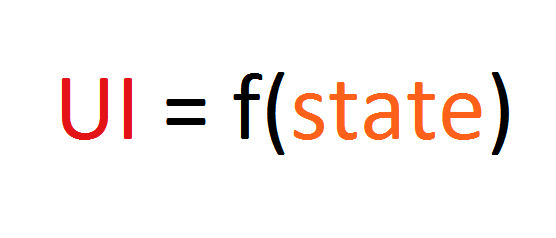

# react从入门到放弃

## JSX 简介

```react
const element = <h1>Hello, world!</h1>;
```

JavaScript 的语法扩展

### jsx中嵌入 !表达式

什么是表达式?

```react
const world = 'world';
const element = <h1>Hello, {world}</h1>;

const obj = {};
const element = <h1 src={{a: 1}}>h1</h1>
```

### jsx元素的属性

```react
const element = <div tabIndex="0"></div>;

//or
const baidu = 'https://www/baidu.com';
const element = <a src={baidu}></a>;
```

**JSX 语法上更接近 JavaScript 而不是 HTML，所以JSX 属性尽量使用驼峰命明, 例如 class 属性在 react 中被改写成 className**


### jsx 究竟是什么?

Babel 会把 JSX 转译成一个名为 `React.createElement()` 函数调用。

```react
const element = (
  <h1 className="greeting">
    Hello, world!
  </h1>
);
```

效果等同于

```js
const element = React.createElement(
  'h1',
  {className: 'greeting'},
  'Hello, world!'
);
```

实际上它创建了这么一个对象

```js
// 简化结构
const element = {
  type: 'h1',
  props: {
    className: 'greeting',
    children: 'Hello, world!'
  }
};
```

## 元素

元素是构成 React 应用的最小块

也就是如 div, span, p 的 HTML标签

### 将元素渲染到 DOM 上

```react
const element = (
  <h1 className="greeting">
    Hello, world!
  </h1>
);

ReactDOM.render(element, document.getElementById('root'));
```


**React可以渲染什么?**

+ 组件
+ 元素
+ 基础类型的数据结构
+ 以上内容组成的数组


### 假设我要更新 DOM

```react
function tick() {
  const element = (
    <div>
      <h1>Hello, world!</h1>
      <h2>It is {new Date().toLocaleTimeString()}.</h2>
    </div>
  );
  ReactDOM.render(element, document.getElementById('root'));
}

setInterval(tick, 1000);
```

**但我们一般不这么做**

**我们可以看看它如何更新 DOM 的.**


## 组件

组件人为构建的可复用的(由元素构成的)代码片段

### class 组件

```react
class Button extends React.Component {
  render() {
    return <button className="btn">button<button>
  }
}
```

### 渲染组件

```react
ReactDOM.render(<Button></Button>, document.getElementById('root'));
```

**!组件名称必须以大写字母开头**

### props

是元素&组件的属性


### state 和 setState

是元素的状态

什么是状态, 以及我们在程序中应该把什么东西抽象为状态 ?


### 生命周期

+ constructor

+ componentDidMount

  一般我们会在这里处理网络请求.

+ componentWillUnmount


## 事件处理

在 html 中

```html
<button onclick="sayhi">
  Activate Lasers
</button>
```

在 react 中

```react
<button onClick={activateLasers}>
  Activate Lasers
</button>
```


## React意义和哲学♂♀



### 声明式的 UI 编程

**声明式编程描述目标what, 命令式编程描述过程how**

🌰

```
声明式: 
我要去成都

命令式:
我坐 346 下山
我坐轻轨到北站
我坐G8501到成都
```

用 HTML 去创建 UI 方便还是用 JS 创建 UI 方便? 


在命令式的编程中, 状态变得越来越复杂时, 我们变得非常暴力🐸, 我们会牺牲性能换取代码的便利性, 我们会越来越**声明式**


### 虚拟 DOM 


### 总结

+ 概念贼多, API 极少
+ 组件化(模块化)
+ 开发效率
+ "高性能"
+ 可维护性(越简单越好维护) 


+ 没有双向绑定, 表单开发太麻烦

## 参考资料

https://create-react-app.dev/docs/getting-started

https://zh-hans.reactjs.org/docs/getting-started.html

https://zh-hans.reactjs.org/tutorial/tutorial.html